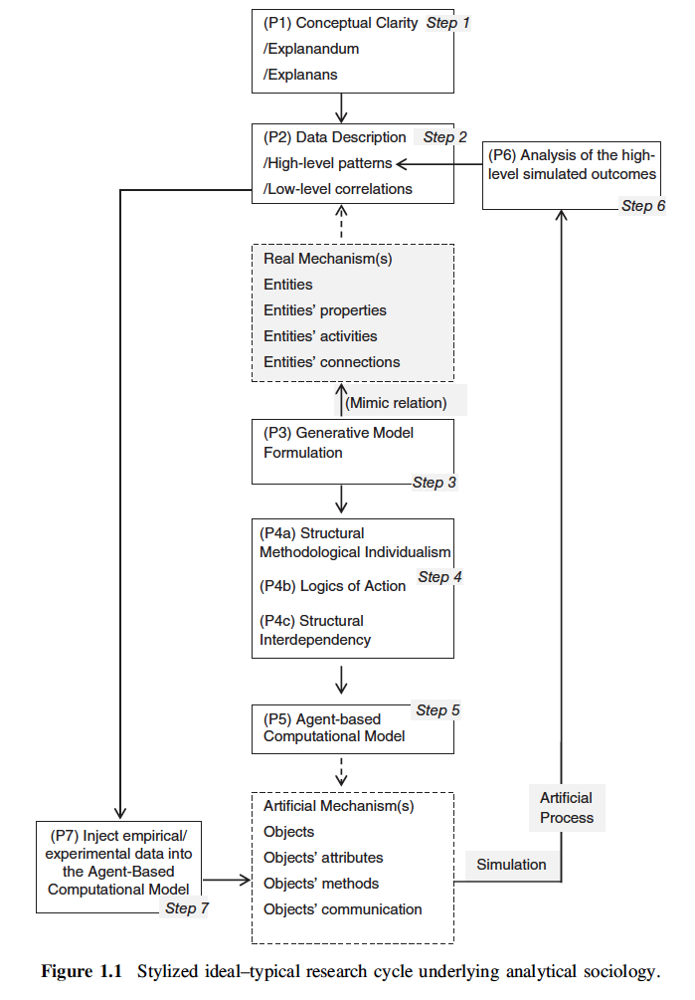

#### 2025JAMS79 数理社会学会ワンステップアップセミナー

# 生成AI時代にこの先生🧑‍🏫きのこ🍄るための数理社会学（再）入門

石田　淳（関西学院大学）
aishida@kwansei.ac.jp

---

## 講師について

- **石田 淳**（<span class="red">**A**</span>tsushi <span class="red">**I**</span>shida）
- 関西学院大学社会学部教授
- https://aishidajt9.github.io
- フリースタイル数理社会学者
- 数理社会学界のAI


---

## 本日の内容

- 数理社会学をこれから始める（再び始める）にあたっての心構え，考え方，tipsを共有する
- 生成AI（LLM）の研究への活用方法を模索する
  - Claude Codeをメインにデモ
- 参加者間での情報交換
- 配付資料（clone or download）
  - https://github.com/aishidajt9/2025JAMS79_Seminor

---

# 数理社会学（再）入門


---

## GPTとは？
- **OpenAI**が開発した大規模言語モデル（LLM）
- **<span class="red">G</span>enerative**：テキストを生成する
- **<span class="red">P</span>re-trained**：大量のデータで学習済みの
- **<span class="red">T</span>ransformer**：注意機構を使った深層学習モデル
- 2022年ChatGPT公開で一般に普及
  - https://chatgpt.com
- 2025年8月に最新のGPT-5が公開

---

## Transformerとは？（by Claude Code）
- **Attention Mechanism**を用いたニューラルネットワークアーキテクチャ (Vaswani et al., 2017)
- 自然言語処理（NLP）での性能向上に寄与
- **BERT**や**GPT**などのモデルで採用
- **自己注意**（Self-Attention）により，文脈を考慮した処理が可能
- **並列処理**が可能で，学習効率が向上

---

<style scoped>
.center {
  text-align: center;
}
</style>

<div class="center">


(Vaswani et al., 2017, Fig. 1)

</div>

---

## LLMの本質

- 「LLMは本質的に，トレーニング中に提供されるテキストを模倣するテキスト補完エンジンにすぎない」 (Berryman & Ziegler, 2025)
- 現在のLLMは真の論理的推論を実行できず，訓練データから推論ステップを複製しているにすぎない (Mirzadeh et al., 2024)
- 真の意味での知性をモデル化しているかどうかはよくわからない，でも使えるから使おう
- イシダのLLMのイメージ：
  - 『葬送のフリーレン』における魔族
  - 『千と千尋』で釜爺に使われるススワタリ

---

## LLMのイメージ

<div class="columns">
<div class="column">


</div>
<div class="column">


</div>
</div>

---
## socGPT

- Inspired by the conversation with Kenji Kosaka
- GPT: <span class="red">**G**</span>enerative <span class="red">**P**</span>re-trained <span class="red">**T**</span>ransformer model
- socGPT: <span class="red">**G**</span>enerative <span class="red">**P**</span>rocess-oriented <span class="red">**T**</span>oy model for social phenomena
- LLMは予測（模倣）・応用のための言語生成モデル
- 数理社会学モデルは<span class="red">**理解**</span>のための社会現象生成モデルであるべき

---

## 数理社会学における生成モデルの系譜

### Fararo
- 生成プロセス：観察可能なストカスティックプロセスを生成する理論プロセス (Fararo 1969)
- プロセス世界観にもとづく生成メカニズムのモデル化 (Fararo 1989=1996)
- 生成アプローチにもとづく階層イメージの生成理論の構築 (Fararo & Kosaka 2003)

----

## 数理社会学における生成モデルの系譜

### Boudon
- Generating Models as a Research Strategy (Boudon 1979)
- 社会学理論と統計分析，量的分析とウェーバー的理解の調停
- 原子論と社会学主義のピットフォールの回避

### Analytical Sociology
- 分析社会学の原理 (Manzo 2014)

---

<style scoped>
section {
  font-size: 26px;
}
</style>

## 数理社会学モデルの特徴

### 社会理解の基本要請：
  - 社会は複雑で可変的なものであるが，ところどころに反復的なパターンが見られる．こうしたパターンをみんなで理解したい（究極的には再帰的な社会改善に寄与したい）

### モデリング戦略：
- 中範囲理論：グランドセオリーを志向しない
- 低次の近似：単純な構造 $S=M+o(x^3)$，少数のパラメタ
- 行為者の意図の実装：エージェントベースド
- 行為のアグリゲーション：Coleman's boat
- <span class="red">**生成メカニズムをブラックボックスにしない**</span>
---

## Coleman's Boat (Coleman 1986)


---

## モデリングの技法

1. 現象を生成するもっともらしいメカニズムを考え，モデル化（アブダクション）
2. モデルから定理を導出，あるいは結果をシミュレーション（ディダクション）
3. 観察データと比較し，モデルの妥当性を検証（インダクション）

---


<div class="columns">
<div>

分析社会学の原理 (Manzo 2014)

Generative Model Formulation

- Structural Methodological Individualism
- Logics of Action
- Structural Interdependency

</div>

<div>



</div>
</div>

---

## 隗より始めよ

- カツカレーより始めよ（浜田 2020）
- 写経より始めよ（イシダ 2025）
  - Toy modelは紙と鉛筆，簡単なコードで再現可能
- オモローをみつける（『理論と方法』次号特集）
  - 転がして天啓を待ち機を逃さずコネコネする
  - 生活者（内部観察者）としての視点と分析者（外部観察者）としての視点を往還する


---

# AI Boosted Mathematical Sociology

---

## 生成AI時代の数理社会学

1. Bare-handed Mathematical Sociology
2. <span class="red">**AI-Boosted Mathematical Sociology**</span>
3. AI-Generated Mathematical Sociology
4. AI-Dominated Mathematical Sociology

---


---

## 研究支援AI

- 一般用途
  - ChatGPT, Claude, Gemini, etc.
- 検索，情報収集特化型
  - Perplexity, ScholarAI, Elicit, etc.
- コーディングAI
  - GitHub Copilot, <span class="red">**Claude Code**</span>, Gemini-cli, etc.
- IDE統合
  - Cursor, Windsurf, Kiro, etc.

---

## Claude Codeの概要 (by Claude Code)

- **Anthropic**が開発したAIアシスタント「Claude」のCLI版
- ファイル操作・編集・実行を統合したコーディング環境
- 主な特徴：
  - ファイル読み書き、検索、編集機能
  - Bash/Python等のコード実行
  - Git操作、プレゼンテーション作成支援
  - プロジェクト全体の理解と管理
- **研究活用例**：
  - 論文執筆・スライド作成
  - データ分析・可視化
  - 数理モデルの実装とシミュレーション

---
## Claude Codeの概要 (by イシダ)

- プロジェクトディレクトリで動作し，ターミナルからコマンド操作ができる生成AI
  - ディレクトリの中に<span class="orange">✹✹</span>Claudeウニ<span class="orange">✹✹</span>がうようよいるイメージ
- 生成AIがエージェント（代理人）のように振る舞う
- Claudeのプロ以上の契約，もしくはAPIでの利用
  - https://docs.anthropic.com/ja/docs/claude-code/overview
- 類似ツール: Gemini-cli, OpenAI codex, Cursor CLI, etc.

---

## イシダの現在の課金状況

- Claude pro契約（年$200）
  - Claude app
  - Claude Code (sonnet 4)
- Github Education (free for students and teachers)
  - https://github.com/education?locale=ja
  - Github Copilot
- Google free account
  - Gemini-cli
  - NotebookLM

---

## イシダの現在の構成

- macOS Sequoia
- Homebrew
- Note: Obsidian + Claude app
- R, TeX:
  - Positron (https://positron.posit.co/)
  - Claude Code (with claude-code extension)
- Python, TeX:
  - VS Code (https://code.visualstudio.com/)
  - Claude Code (with claude-code extension)
  - GitHub Copilot

---

## 実演

- クイックスタート
  - https://docs.anthropic.com/ja/docs/claude-code/quickstart
- CLIコマンド
  - https://docs.anthropic.com/ja/docs/claude-code/cli-reference

for macOS:
```bash
brew install node
npm install -g @anthropic-ai/claude-code
claude
```
---

## 実演

- インタラクティブモード
  - https://docs.anthropic.com/ja/docs/claude-code/interactive-mode
- スラッシュコマンド
  - `/kurochan`
  - `.claude/commands/kurochan.md`で定義
  - https://docs.anthropic.com/ja/docs/claude-code/slash-commands

---

## 実演

- メモリ管理
  - `/init`で初期化
  - `CLAUDE.md`でメモリを管理
  - `# 指示`で指示を追加
  - https://docs.anthropic.com/ja/docs/claude-code/memory
- フック
  - macの`terminal-notifier`を使う例
  - `.claude/settings.json`に記述
  - https://docs.anthropic.com/ja/docs/claude-code/hooks


---

## その他の機能

- MCP (Model Context Protocol)
  - 外部ツールやデータソースとの連携
  - Claude appの設定を取り込める
  - https://docs.anthropic.com/ja/docs/claude-code/mcp
- サブエージェント
  - タスクを委任するサブエージェントを事前設定して呼び出せる
  - https://docs.anthropic.com/ja/docs/claude-code/sub-agents
- 出力スタイル (/output-style)
  - Default, Explanatory, Learning
---

## 注意

- 必ず安全に切り離されたプロジェクトディレクトリで実行し，ルートディレクトリとかホームディレクトリで絶対に実行しない
  - 油断したら`rm -rf`される
  - コンテナ内での利用も検討する
- Claude Codeの吐き出すコードをよく読んで承認を与える
  - 違うことを始めたら`Esc`
  - plan-modeの活用，`Shift + Tab`
- できるだけコンテキストを明示化する
  - `CLAUDE.md`の活用・管理

---

## Claude Codeをどういうときに使ってるか

- ディレクトリ環境構築・保全
  - プロジェクトのセットアップ
  - Git管理
- コーディング
  - いまのところ補完的な使い方がメイン
  - オプションやライブラリの使い方を聞く
  - コードの整理（モジュール化，リファクタリング）
- ドキュメント生成
  - md形式の技術文書
  - 要約，スライド作成
- 外部情報の探索（Claude app優先）

---

## AI-boosted Mathematical Sociology

- にんげんがさきAIは後（みつを）
- 考えること，理解することをAIに完全に任せない
- AIの得手不得手を理解し，適切に活用する
  - パターン認識・定型作業・コード生成は得意
  - 複雑な論理推論・創造的思考は限界がある
  - 数式処理はあまり信用しない方がよさそう
- あくまでオーサーシップは人間にある（いまのところ）
- しかしAIのさらなる進化には備えておく必要がある

---


---
## 質疑応答

なんでもどうぞクロ！

---

<style scoped>
section {
  font-size: 16px;
}
</style>

## 参考文献

Berryman, J., & Ziegler, A. (2025). *LLMのプロンプトエンジニアリング*. オライリー・ジャパン.

Boudon, R. (1979). Generating Models as a Research Strategy. In R. K. Merton, J. S. Coleman, & P. H. Rossi (Eds.), *Qualitative and Quantitative Social Research: Papers in Honor of Paul F. Lazarsfeld* (pp. 51-64). The Free Press.

Coleman, J. S. (1986). Social Theory, Social Research, and a Theory of Action. *American Journal of Sociology*, 91(6), 1309–1335.

Fararo, T. J. (1969). Stochastic processes. *Sociological Methodology*, 1, 245–260.

Fararo, T. J. (1989=1996). *一般理論社会学の意味*. ハーベスト社.

Fararo, T. J., & Kosaka, K. (2003). *Generating Images of Stratification*. Kluwer Academic Publishers.

浜田 宏 (2020). *その問題、やっぱり数理モデルが解決します*. ベレ出版.

Manzo, G. (2014). Data, generative models, and mechanisms: More on the principles of analytical sociology. In Analytical Sociology, G. Manzo (Ed.).

Mirzadeh, I., et al. (2024). GSM-Symbolic: Understanding the Limitations of Mathematical Reasoning in Large Language Models. *arXiv preprint arXiv:2410.05229*.

Vaswani, A., et al. (2017). Attention is all you need. *Advances in Neural Information Processing Systems*, 30.

